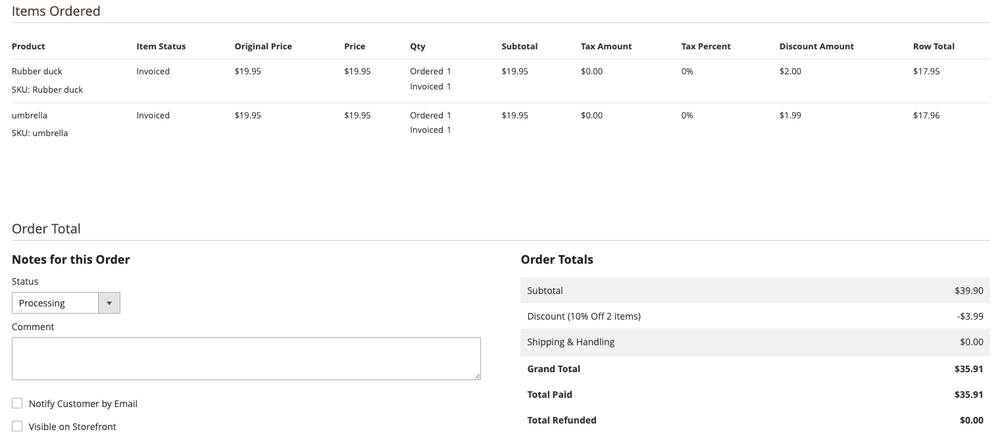

# 建立購物車價格規則

購物車價格規則會根據一組條件，將折扣套用至購物車中的專案。 當滿足條件或客戶輸入有效優惠券代碼時，可自動套用折扣。 套用時，折扣會顯示在小計下的購物車中。 如有需要，可以透過變更其狀態和日期範圍，將購物車價格規則用於季節或促銷活動。

## 這部影片是給誰看的？

- 電子商務行銷人員
- 網站管理員

## 視訊內容

>[!VIDEO](https://video.tv.adobe.com/v/343835?quality=12&learn=on)

## 定價顯示問題

有些獨特案例會要求每個明細專案顯示其所提供的折扣，但值可能並不完全相符。 原因是購物車價格規則折扣已套用至多個產品，但值未平均分成兩位小數。

>[!BEGINSHADEBOX]

購物車價格規則=套用至購物車中2個產品的10%折扣價格規則生效的條件：購物車中的料號總計為2動作套用產品價格折扣的百分比，該折扣金額為10

有2個專案加入購物車，每個價值$19.95美元

若要取得折扣金額乘以產品價格0.1

19.95 x 0.1 = 1.995

這就是問題所在，我們有3位小數，而不是2位。 將這筆錢轉換為美元現在是個問題

>[!ENDSHADEBOX]

### 解決方案

回想一下唯一受此問題影響的人員，發現以美元折扣訂購的每件商品顯示最為合適。 為了確保正確計算整個訂單金額，決定舍入第一個專案，而其他專案捨棄第三個小數。 檢閱此情境：

>[!BEGINSHADEBOX]

如同上述購物車規則的10%折扣實際新增2個產品(19.95)到購物車

每項產品可獲得$1.995的折扣產品1 - 19.95 x 0.1 = 1.995 2 - 19.95 x 0.1 = 1.995

總金額為3.99的客戶可獲得折扣

在管理員中向商店所有者顯示條列專案時，我們需要調整第一個專案並將其四捨五入到2.000。第二個專案，我們將第三個小數點產品1捨棄為2.00產品2 = 1.99

這兩種產品加總後的總折扣符合提供給客戶的實際折扣。
>[!ENDSHADEBOX]

以下是熒幕擷圖，當訂單具有此情境時，其顯示在管理員中：

### 其他可能的解決方案，以及未使用它們的原因

>[!BEGINSHADEBOX]

如同上述購物車規則的10%折扣實際新增2個產品(19.95)到購物車

每件產品可獲得$1.995的折扣，但如果我們湊整的話，就會顯示太多折扣。

產品1 - 19.95 x 0.1 = 1.995產品2 - 19.95 x 0.1 = 1.995

轉換為四捨五入所有專案產品1新值為2.00產品2新值為2.00

實際提供3.99的全額折扣給客戶，但如果我們彙總，就會顯示已提供$4.00，這是不正確的。

2.00 + 2.00 = $4.00

>[!ENDSHADEBOX]

類似的問題如果捨棄所有專案的第三個小數，則會顯示提供的折扣太少。

>[!BEGINSHADEBOX]

如同上述購物車規則的10%折扣實際新增2個產品(19.95)到購物車

每個產品可獲得$1.995的折扣，但如果我們直接捨棄小數點後的第三個數字，就會發生以下情況：產品1 - 19.95 x 0.1 = 1.995產品2 - 19.95 x 0.1 = 1.995

轉換成捨棄所有專案的第三個小數點產品1新值為1.99產品2新值為1.99

實際提供3.99的總額作為客戶的折扣，但如果我們捨棄小數點後的第三個，則會顯示$3.98已提供，而且這是不正確的。

1.99 + 1.99 = $3.98

>[!ENDSHADEBOX]

## 其他資源

- [建立購物車價格規則 —  [!DNL Commerce] Merchandising and Promotions指南](https://experienceleague.adobe.com/docs/commerce-admin/marketing/promotions/cart-rules/price-rules-cart-create.html)
- [優惠券代碼 —  [!DNL Commerce] Merchandising and Promotions指南](https://experienceleague.adobe.com/docs/commerce-admin/marketing/promotions/cart-rules/price-rules-cart-coupon.html)
